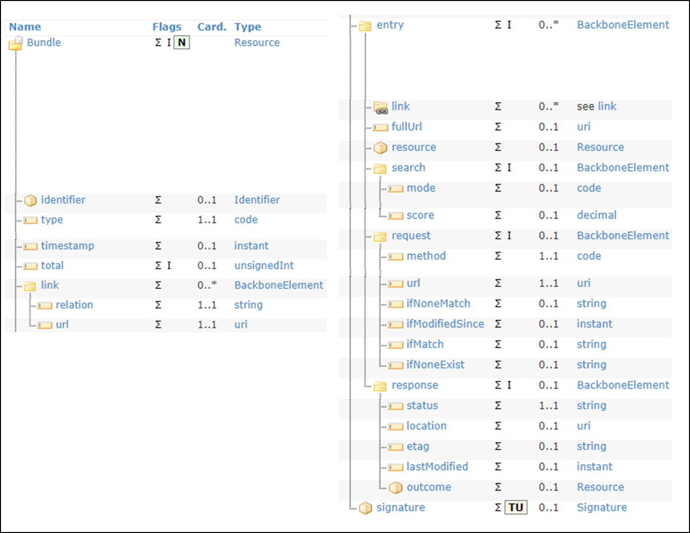
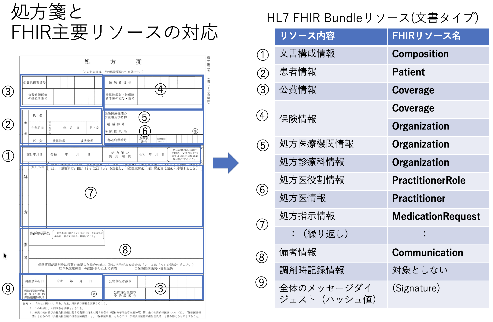
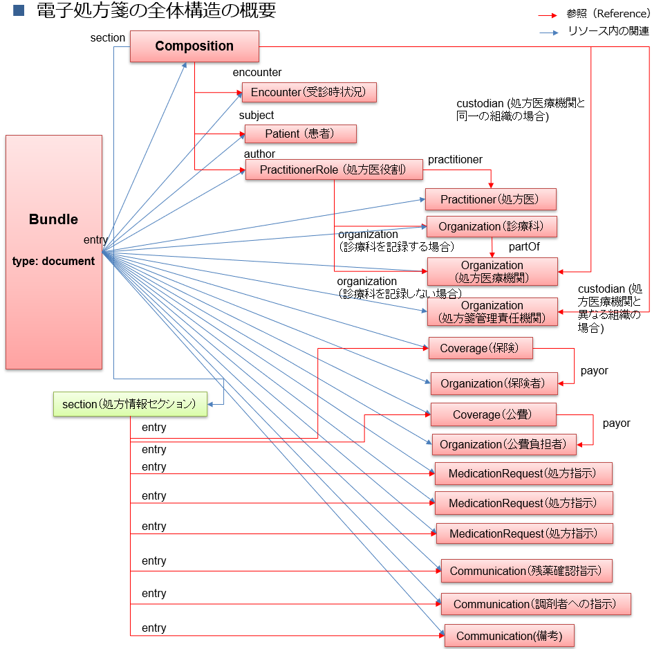
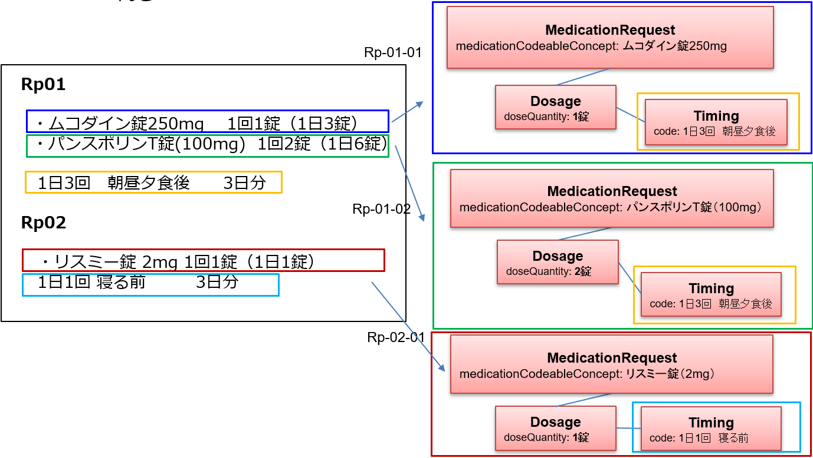
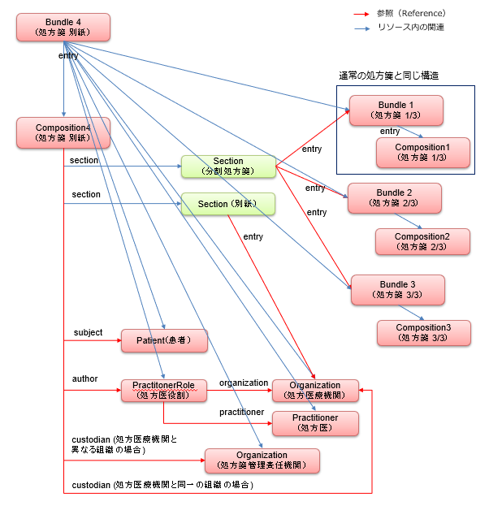

  <style type="text/css">

table {
  border: solid 1px black;
  border-collapse: collapse;
}
 
table td {
  border: solid 1px black;

}
table th {
  border: solid 1px black;
   h1 {
      counter-reset: chapter;
    }

    h2 {
      counter-reset: sub-chapter;
    }

    h3 {
      counter-reset: section;
    }

    h4 {
      counter-reset: sub-section;
    }

    h5 {
      counter-reset: composite;
    }

    h6 {
      counter-reset: sub-composite;
    }

    h1:before {
      color: black;
      counter-increment: bchapter;
      content:  " ";
    }

    h2:before {
      color: black;
      counter-increment: chapter;
      content: counter(chapter) ". ";
    }

    h3:before {
      color: black;
      counter-increment: sub-chapter;
      content: counter(chapter) "."counter(sub-chapter) ". ";
    }


    h4:before {
      color: black;
      counter-increment: section;
      content: counter(chapter) "."counter(sub-chapter) "."counter(section) " ";
    }

    h5:before {
      color: black;
      counter-increment: sub-section;
      content: counter(chapter) "."counter(sub-chapter) "."counter(section) "."counter(sub-section) " ";
    }

    h6:before {
      color: black;
      counter-increment: sub-sub-section;
      content: "　　"counter(sub-sub-section) "）";
    }
</style>

日本医療情報学会　2021年10月


# **処方情報HL7&reg; FHIR&reg;記述仕様書 第1版**

## 本文書の位置づけ
この仕様書は、HL7 FHIR（以下、単に「FHIR 」という）に準拠した処方情報の記述仕様の文書であり、令和2年度厚生労働行政推進調査事業費補助金 令和2年度厚生労働科学特別研究事業「診療情報提供書, 退院時サマリー等の電子化医療文書の相互運用性確保のための標準規格の開発研究」 (課題番号20ⅭＡ2013）（以下、単に「R2厚生科研研究班」という）の成果物を、その作成者らが編集したものである。
以下では本仕様書という。
本仕様書は、電子処方箋CDA記述仕様 第1版（以下、「CDA処方規約」、もしくは単に「CDA規約」という）を参考にして、処方情報作成システム（処方オーダシステム）や電子処方箋作成システムにより作成され登録される処方情報を、FHIRに準拠して記述する仕様として作成されたものであり、電子処方箋のFHIR仕様ではない。
また、本仕様書の作成にあたって、ベースとしたFHIR 仕様には、FHIR R4に修正を加えたVer. 4.0.1(Oct-30, 2019)を採用しているが、それ自体がNormative（標準） として確定した仕様となっていないものを多く含んでいる。そのため、元となるFHIR仕様が変更されることがあるが、本仕様書の明示的な改版時まではその変更の影響を受けないものとする。

## 仕様の適用範囲
処方と実施に関する情報としては、
　1）処方指示情報
　2）処方指示にもとづく調剤記録情報
　3）調剤された医薬品についての服用指示情報
　4) 医療者による服薬実施情報と患者による服用実施記録情報
などがある。
本仕様書では、1）の情報だけを扱う。2）から4）の情報は、異なる仕様として別に作成されることを想定している。
従って、本仕様は、処方箋として交付され電子データとしてデータベース等に蓄積された情報をFHIR準拠の記述データとして作成し、FHIR規格対応のソフトウエアで処理することやFHIRデータサーバに蓄積すること、処方情報作成システム（処方オーダシステム）や電子処方箋作成システムが作成した処方情報をFHIR準拠の記述データとして作成し、別のシステムに伝送したり電子的な診療情報提供書や退院時サマリーに添付するときなどに使用することが想定される。

## 本仕様の適用範囲外
本仕様は、上述したように、処方箋情報を1）処方作成、2）調剤、3）服薬指示、4）服用実施・服用記録、といった一連の業務フローにおける記録のなかで使用することを想定して作成されたものではない。そのため、たとえば分割処方調剤の運用に対応した分割処方情報の作成と記録、疑義照会記録、後発医薬品への変更記録や変更不可時の電子署名、調剤時の規格変更や用量、日数の変更記録などには対応していない。
これらの情報を含めて記述し、業務の中で運用するには、他にもさまざまな仕様の取り決めと運用ルールの作成が必要であり、本仕様書では対応していないことに、十分留意すべきである。繰り返しになるが、電子処方箋のFHIR仕様ではない。

## 参照する仕様等
本文書は、以下の仕様等を参照して作成された。
  * HL7FHIR R4 Ver.4.0.1 [[http://hl7.org/fhir/R4/](http://hl7.org/fhir/R4/)]　 本仕様書ではFHIR基底仕様という。
  * JAHIS電子処方箋実装ガイド Ver.1.2 [[https://www.jahis.jp/standard/detail/id=774](https://www.jahis.jp/standard/detail/id=774)]
  * 電子処方箋CDA記述仕様 第1版 [[https://www.mhlw.go.jp/content/10800000/000342368.pdf](https://www.mhlw.go.jp/content/10800000/000342368.pdf)]
  * SS-MIX2標準化ストレージ仕様書Ver.1.2g 別紙：コード表(2020.12.25版) [[http://www.jami.jp/jamistd/docs/SS-MIX2/f/SS-MIX2_StndrdStrgSpecVer.1.2gCodeTable.pdf](http://www.jami.jp/jamistd/docs/SS-MIX2/f/SS-MIX2_StndrdStrgSpecVer.1.2gCodeTable.pdf)]
  * 日本医療情報学会JAMI標準(JAMISDP01)：標準用法規格[[http://jami.jp/jamistd/](http://jami.jp/jamistd/)]

## 文書データの表現形式
### ファイル形式
ファイル形式は、JSON形式（JavaScript Object Notation：RFC 8259、IETF STD 90、ECMA-404 2nd edition）とする。
ファイル名を有するファイルを作成する場合には、特に送受信施設間で別の取り決めがない限り、.json の拡張子を末尾に付与するものとする。
### 文字集合
文字集合はUnicode文字セットとする。これはISO/IEC 10646：2017 （JIS　X0221国際符号化文字集合）と同一である。
### 符号化形式
文字符号化形式は、UTF-8（ISO/IEC 10646　UCS Transformation Format 8）とする。ネットワーク上で直接データを送受信することを想定し、バイト順マーク（BOM：byte order mark：UTF-8では0xEF 0xBB 0xBF ）を先頭に付与しないものとする。

## 処方情報FHIR記述の全体構造
### 全体構造
FHIR では、医療情報はFHIRリソースと呼ばれる単位で記述される。処方箋に記述される処方情報は文書形式のデータの一種である。
FHIRにおけるBundleリソースは、複数のFHIRリソースの集合を、あるコンテクストに関する情報（この場合には、処方箋の作成に関する日付情報や発行者、発行機関情報など）とともにひとまとまりの情報にまとめあげたものを記述するのに使われるFHIRリソースであり、以下のような要素から構成される。あるシステムから別のシステムに処方情報を送信する場合は、このBundleリソースの単位で行われる。


<br clear="all">
図1 Bundleリソース

[[http://hl7.org/fhir/bundle.html]](http://hl7.org/fhir/bundle.html)]
そして、このBundleリソースのtype要素（上図左段の2つめの要素）の値を"document"とすることにより、Bundleリソースのひとつのタイプである、FHIR Documentを記述できる。
そこで、本文書では、処方箋１文書に 相当する処方情報を、FHIRにおけるBundleリソース のひとつのタイプであるFHIR Documentにより記述することとする。[[http://hl7.org/fhir/documents.html]](http://hl7.org/fhir/documents.html)]

紙の処方箋を構成する情報との対応を図 2に示す。
<br clear="all">
図2 紙の処方箋を構成する情報とFHIRリソースとの対応関係

以降の章では、処方箋を構成するFHIRリソースの記述仕様を、次の項目に従って共通の表形式で記述する。

| |            |                                                                                                                          |
|-|------------|--------------------------------------------------------------------------------------------------------------------------|
| |項目        |説明                                                                                                                      |
|1|No          |表内で要素を識別するための番号。同一階層を同一桁数で表す。                                                                |
|2|要素Lv  1～n|FHIRリソースに含まれる要素。要素の階層ごとに列を分けて記載する。                                                          |
|3|多重度      |要素の出現数の最小値と最大値を表す。最小値が0の要素は、省略することができる。最小値が1の要素は必ず出現しなければならない。|
|4|値          |固定値、あるいは、例示された値。                                                                                          |
|5|型          |要素のデータ型。                                                                                                          |
|6|説明        |要素の説明と記録条件仕様。                                                                                                |


本文書は、FHIR基底仕様で定義されたリソース、及び、データ型の定義に対して、処方情報仕様のための制約を追加している。そのため、要素の多重度や使用可能なコード値について、FHIR基底仕様に、より強い制約が加えられていることに注意する。
また、表中では、繰り返し可能なJSON要素を、多重度 0..\* 、または、1..\* として1行で記述する方法（例: 表１  No.15 Bundle.entry要素）と、繰り返しの要素ごとに展開して記述する方法（例：表１ No.6 Bundle.entry要素）の2通りの書き方を使用している。いずれの場合も、繰り返される要素は、JSONインスタンス中では [ 　] で括られた配列として表現され、要素名は1つしか出現しないことに注意する。
処方情報の中に、処方箋として法的に必要となる項目を含めて記述しなければならないような用途でFHIR準拠データを作成する場合には、それに対応している情報項目の多重度の最小値が0（任意要素）であっても、値を必ず設定することが必要である。また、FHIRリソースの基底仕様で定義されている任意要素で、本仕様に記載のない要素は、原則としてJSONインスタンス中に出現してはならない。仮にその要素を出力した場合、受信側は処方情報全体をエラーとして受信しなかったり、その要素の情報を受信しなかったりする可能性があることに注意が必要である。
なお、本文書の表で出現するデータ型のうち、基本データ型については、8章で説明している。


### FHIR Document
FHIR Documentの仕様では、Bundleリソースのentry要素内にresource要素を繰り返す基本構造をとり、最初のresource要素はComposition リソースであることと規定されている。Composition リソースとは、この文書に含まれる他のすべてのリソース（情報単位）への参照を列挙するためのもので、いわば構成リソースの一覧目次のような役割を果たす。
処方情報Documentでは、以下のようなBundleリソース内の基本構造とする。

|                                    |                         |                                                       |
|------------------------------------|-------------------------|-------------------------------------------------------|
|要素                                |格納するリソース         |内容                                                   |
|entry                               |Compositionリソース      |文書構成情報（6.3）                                    |
|entry                               |Patientリソース          |患者情報（6.4）                                        |
|entry                               |Encounterリソース        |受診時状況情報（6.5）                                  |
|entry                               |Coverage リソース        |保険情報（6.6.1）                                      |
|entry                               |Coverageリソース         |公費情報（6.6.2）                                      |
|entry                               |Organizationリソース     |費用負担者（保険者等）情報（6.6.3）                    |
|entry                               |Organizationリソース     |処方医療機関情報（6.7.1）                              |
|entry                               |Organizationリソース     |処方診療科情報（6.7.2）                                |
|entry                               |PractitionerRoleリソース |処方医役割情報（6.8.1）                                |
|entry                               |Practitioner リソース    |処方医情報（6.8.2）                                    |
|entry                               |MedicationRequestリソース|処方指示情報（6.9）                                    |
|：処方される医薬品の数だけ繰り返し：|                         |                                                       |
|entry                               |Communication リソース   |処方箋全体の指示、明細単位での備考記述 (6.9.8.2、6.9.9)|


Bundleリソースの要素記述仕様を表1に示す。

＜[Bundleリソース処方][JP_Bundle_ePrescriptionData]＞
＜[仕様表1](ePreTables.html#tbl-01)＞
 
この表で示すように、documentタイプのBundleリソースでは、管理的な情報を格納する要素としてtimestamp、 signature などがあり、文書自体の内容情報を格納する要素として、ひとつのentry要素（エントリリスト）がある。このentry要素の値には、複数のresource要素を含むブロックが繰り返される。
entryの最初のresource は、先に述べたように、構成リソース一覧目次を表すCompositionリソースである。
２つめのリソース以降に、Compositionリソースから参照される Patientリソース、受診時状況情報を表すEncounterリソース、保険情報などを表す複数個のCoverageリソース、及び、保険者を表すOrganizationリソース、処方医療機関情報、及び、診療科を含むOrganization リソース、処方医の役割を表現するPractitionerRoleリソース、および、処方医師情報を含むPractitionerリソースが出現する。
その後に、１医薬品処方指示がひとつのMedicationRequestリソースで記述され、それが医薬品の数だけ繰り返し出現する。
最後に処方箋の備考欄や薬局への指示情報などがCommunicationリソースにより記述される。
エントリリスト内の各FHIRリソースを記述する際には、エントリリスト内でそのリソースを一意に識別するために、resource要素と1対1で対応するfullUrl要素に、UUID（Universally Unique IDentifier）と呼ばれる、全世界で一意となるように発番された値を指定する。このUUIDは、Bundle内でリソース間の参照関係を記述する場合に使用される。具体的には、参照関係の参照元リソースに含まれる Reference型のreference要素に、参照先リソースの fullUrl要素に指定されたUUIDを指定する。
なお、FHIRのリソース参照では、リソースのid要素（論理ID）の値を含むURLを使用する方法も可能であるが、本文書ではUUIDを使用してリソース間の参照を記述する方法を採用するため、全てのリソースについて、リソースの論理IDは使用しない。

Bundleリソース、及び、エントリリスト内に含まれる各リソースの参照関係を図 3に示す。


```
処方情報の全体構造の概要
```
<br clear="all">
図 3 処方情報データの全体構造の概要

以下では、まずentryの値である各リソースについて詳述する。

### 文書構成情報
文書構成情報はCompositionリソースにより記述される。Compositionリソースは、処方情報FHIR documentにentry として格納される複数のリソースのうちの最初に出現するもので、この文書全体の構成目次に相当する情報や、セクションの構成を記述したものである。
処方情報は、処方情報セクションと呼ばれるただ１つのセクションから構成される。

＜[Compositionリソース処方](StructureDefinition-JP-Composition-ePrescriptionData.html)＞
＜[仕様表2](ePreTables.html#tbl-02)>＞

Component.identifier要素には、発行された処方情報を一意に識別するID（処方箋番号）を設定する。処方箋IDの採番ルールは本文書のスコープ外であるが、Identifier型のvalue要素に、保険医療機関番号（10桁）、発行年（4桁）、施設内において発行年内で一意となる番号（8桁）をハイフン("-"：U+002D)で連結した文字列を指定する。
例："1311234567-2020-00123456"。本仕様ではこれを採用する。Identifier型のsystem要素には、"http://jpfhir.jp/fhir/Common/IdSystem/resourceInstance-identifier"を指定。

### 患者情報
Patientリソースでは、患者の氏名（漢字等）、性別、生年月日、を必須情報として記述する。また、任意情報として、氏名の読み（カタカナ表記）、医療機関における患者番号 を記述できる。麻薬処方箋の場合には、患者住所を必須情報として記述する。

＜[Patientリソース処方](StructureDefinition-JP-Patient-ePrescriptionData.html)＞
＜[仕様表3](ePreTables.html#tbl-03)＞
＜[例1  Patientリソース処方の記述例](Patient-JP-Patient-ePreData-Example.html)＞

### 受診時状況情報
処方が作成された受診時状況（外来、入院、退院時など）情報を、Encounterリソースにより記録する。本リソースは公文書として発行される処方箋では必須ではないため省略できる仕様としているが、医療機関内での処方情報の管理や、処方情報を患者や他の医療機関とやり取りする上では、通常必須として記述することを推奨する。

＜[Encounterリソース処方](StructureDefinition-JP-Encounter-ePrescriptionData.html)＞
＜[仕様表4](ePreTables.html#tbl-04)＞
＜[例2  Encounterリソース処方の記述例](Encounter-JP-Encounter-ePreData-Example.html)＞

### 保険・公費情報
保険情報、公費情報ともに個々の保険給付ごとに別々のCoverageリソースで記述する。以下ではそれぞれについて説明する。

#### 保険情報
自費など保険のない診療における処方であってもこのCoverageリソースは必須とし、適切な保険種別を指定する。

＜[Coverageリソース処方（保険・自費情報）][JP_Coverage_ePrescriptionData_insurance]＞
＜[仕様表5](ePreTables.html#tbl-05)＞
＜[例3  Coverageリソース処方（保険・自費情報）の記述例](Coverage-JP-Coverage-ePreData-insurance-Example.html)＞

#### 公費情報
公費医療をうける場合のみ必要。複数の公費医療の場合には、その数だけCoverageリソースを繰り返す。公費医療でない場合には記述は不要。

＜[Coverageリソース処方（公費情報）](StructureDefinition-JP-Coverage-ePrescriptionData-publicPayment.html)＞
＜[仕様表6](ePreTables.html#tbl-06)＞
＜[例4  Coverageリソース処方（保険・自費情報）の記述例](Coverage-JP-Coverage-ePreData-publicPayment-Example.html)＞

#### 費用負担者（保険者等）情報
保険種別が「6:自費」以外の場合、費用負担者情報を、Coverageリソースのpayorから参照されるOrganizationリソースとして記録する。保険種別が「1:医保」、「2:国保」、「7:後期高齢者」の場合は保険者を意味し、Organization.identifier要素に保険者番号を記録する。その他の保険種別の場合は、identifier要素は出現しない。費用負担者の名称を可能な範囲でOrganization.name要素に記録する。

＜[Organizationリソース処方（費用負担者（保険者等）情報）](StructureDefinition-JP-Organization-ePrescriptionData-coveragePayer.html)＞
＜[仕様表7](ePreTables.html#tbl-07)＞
＜[例5  Organizationリソース処方（費用負担者（保険者等）情報）の記述例](Organization-JP-Organization-ePreData-coveragePayer-Example.html)＞

###  処方医療機関と診療科情報
####  処方医療機関情報
処方を作成した医療機関の情報をOrganizationリソースに格納する。
処方医療機関情報を記述する際に、診療科情報の記述は必須ではない。診療科情報を記述せずに、医療機関情報だけを記述する場合には、本項のOrganization リソースのみを記述する。
診療科情報と医療機関情報の両方を記述したい場合には、本項のOrganization に加えて、「6.7.2　処方診療科情報」に後述するもうひとつのOrganizationリソースを用いて診療科情報を記述する。

＜[Organizationリソース処方（処方医療機関情報）](StructureDefinition-JP-Organization-ePrescriptionData-issuer.html)＞
＜[表8　仕様](ePreTables.html#tbl-08)＞
＜[例6  Organizationリソース処方（処方医療機関情報）の記述例](Organization-JP-Organization-ePreData-issuer-Example.html)＞


#### 処方診療科情報
処方診療科情報は、以下のOrganizationリソースにより記述し、partOf要素から処方医療機関情報を表すOrganizationリソースを参照する。診療科情報は公文書として発行される処方箋では必須ではないため省略できる仕様としているが、医療機関内での処方情報の管理や、処方情報を患者や他の医療機関とやり取りする上では、必須として記述することを推奨する。

＜[Organizationリソース処方（処方診療科情報）](StructureDefinition-JP-Organization-ePrescriptionData-departmentOfIssuer.html)＞
＜[仕様表9](ePreTables.html#tbl-09)＞
＜[例7  Organizationリソース処方（処方診療科情報）の記述例](Organization-JP-Organization-ePreData-departmentOfIssuer-Example.html)＞


###  処方医師情報
処方医の情報は、医師または歯科医師のいずれかの役割（職種）を表すPractitionerRoleリソースと、処方医個人そのものの情報を表すPractitioner リソースで記述する。

#### 処方医役割情報
医療者が提供する医療サービスにおける役割のカテゴリーコード（本文書では、「doctor：医師」または「dentist:歯科医師」）をPractitionerRoleリソースのcode.coding要素に記録する。
code.coding.system要素には、"http://jpfhir.jp/fhir/Common/CodeSystem/JP_PractionerRole_RoleCode"を指定する。
システムが医師、歯科医師の区別をできない場合には、code要素は省略できる。
identifierには、その医療機関が医療者に付与する「処方を発行する役割」を一意に識別するための識別子を設定する。たとえば、医療機関Aに所属する医師が、医療機関Bにおいて医師として処方を発行する場合、医療機関Bが医師に付与する処方オーダ役割（権限）を識別するIDをPractitionerRoleリソースのidentifierに設定する。identifierは通常は省略しても差し支えない。

＜[PractitionerRoleリソース処方（処方医役割情報）](StructureDefinition-JP-PractitionerRole-ePrescriptionData-author.html)＞
＜[仕様表10](ePreTables.html#tbl-10)＞
＜[例8　PractitionerRoleリソース処方（処方医役割情報）の記述例](PractitionerRole-JP-PractitionerRole-ePreData-author-Example.html)＞

#### 処方医情報
処方医はPractitionerリソースとして記述し、PractitionerRoleリソース（処方医役割情報）から参照する。処方医を識別するIDや番号として、処方医療機関における処方医ID（たとえば端末利用者アカウント、あるいは職員番号など）をPractitionerリソースのidentifier要素に記録する。処方医療機関における処方医IDを記述する場合は、医療機関のOID付番方法（9.1識別子名前空間一覧」を参照）に従ってそのOIDを指定する。
PractitionerRoleリソースのidentifierとPractitionerリソースのidentifierとの違いについては、6.8.1処方医役割情報　を参照のこと。
qualification要素には、必要なら医籍登録番号を記述できる。また、麻薬処方の場合には、qualification要素に、麻薬施用者免許番号を記録する。

＜[Practitionerリソース処方（処方医情報）](StructureDefinition-JP-Practitioner-ePrescriptionData-author.html)＞
＜[仕様表11](ePreTables.html#tbl-11)＞
＜[例9  Practitionerリソース処方（処方医情報）の記述例](Practitioner-JP-Practitioner-ePreData-author-Example.html)＞


### 処方指示情報
#### 処方指示の構造の概要
処方指示の基本構造は以下のようになる。
１医薬品ごとに処方指示がひとつのMedicationRequestリソースにより記述され、医薬品の数だけMedicationRequestリソースが繰り返される。
本文書では以下の記述が可能である。
１）剤グループ構造とその番号（一般にシステムではRp番号などと呼ばれる）
２）内服薬、外用薬、在宅自己注射、麻薬
３）定時用法と頓用
４）均等分割用法と不均等用法
５）毎日と不定期（隔日、曜日、期間指定、指定日）
６）交互、漸増、漸減用法
７）調剤補足情報（一包化、別包、混合、粉砕、その他）
８）明細単位での備考記述

MedicatonRequestリソースの要素の詳細を表12に示す。

＜[MedicatonRequestリソース処方](StructureDefinition-JP-MedicationRequest-ePrescriptionData.html)＞
＜[仕様表12](ePreTables.html#tbl-12)＞
表12のNo.14「dosageInstruction」要素は、Dosage型の要素であり、用法や投与量を表す。

dosageInstruction要素の詳細を表13に示す。

＜[仕様表13](ePreTables.html#tbl-13)＞

表12のNo.15.1 拡張「InstructionForDispense」を表すextension要素は、Extension型の要素であり、調剤者への指示を表す。
本要素の詳細を表14に示す。

＜[拡張InstructionForDispense](StructureDefinition-JP-MedicationRequest-DispenseRequest-InstructionForDispense.html)＞
＜[仕様表14](ePreTables.html#tbl-14)＞

####  剤グループ構造とその番号
HL7 FHIRでは、処方情報の中で同一の用法を持つ剤グループは、剤単位に個別のMedicationRequestリソースに展開される。剤グループとMedicationRequestリソースの関係を図 4に示す。

<br clear="all">
図 4 剤グループ構造

このとき、剤グループの番号（RP番号と呼ぶ）と、同一剤グループ内での順番は、いずれも MedicationRequestリソースの identifier で表現する。RP番号を識別するURIとして、"urn:oid:1.2.392.100495.20.3.81"を使用する。同一剤グループ内での順番を識別するURIとして、"urn:oid:1.2.392.100495.20.3.82"を使用する。value は 文字列型であり、数値はゼロサプレス、つまり、"01"でなく"1"と指定すること。

|                                                                                                                                                           |
|-----------------------------------------------------------------------------------------------------------------------------------------------------------|
|"identifier": [  {    "system": "urn:oid:1.2.392.100495.20.3.81",    "value": "1"  },  {    "system": "urn:oid:1.2.392.100495.20.3.82",    "value": "1"  }]|


同じRp番号を持つ、複数の MedicationRequest リソースの用法指示は、これらの各MedicationRequest リソースに同じ用法指示を繰り返し記述する。
また、剤グループへのコメント指示等は、同じコメント指示を剤グループに含まれるMedicationRequestに繰り返し記述すること。

#### 内服薬、外用薬、在宅自己注射、麻薬
##### 処方薬
処方する医薬品（処方薬）は、MedicationRequestリソースにおいてCodeableConcept 型のmedicationCodeableConcept に記述する。
medicationCodeableConceptは、ひとつのMedicationRequestリソースに1回だけ出現可能であるため、ひとつのMedicationRequestリソースで1処方薬だけを記述できる。従って、複数の処方薬を記述するには、前述したようにその数だけMedicationRequestリソースを繰り返し記述する必要がある。
medicationCodeableConceptは、ひとつのtext要素と、複数のcoding 要素を記述できる。本仕様では、処方オーダ時に選択または入力し、実際に処方箋に印字される文字列を必ずtext要素に格納した上で、それをコード化した情報を1個以上のcoding 要素に記述する。
厚生労働省標準であるHOT9コード（販社指定が不要な場合にはHOT7コード）または広く流通しているYJコードを用いるか、一般名処方の場合には厚生労働省保険局一般名処方マスタのコードを使用して、Coding要素（コードsystemを識別するURI、医薬品のコード、そのコード表における医薬品の名称の3つからなる）で記述する。
なお、上記のいずれの標準的コードも付番されていない医薬品や医療材料の場合には、薬機法の下で使用されているGS1標準の識別コードであるGTIN(Global Trade Item Number)の調剤包装単位（最少包装単位、個別包装単位）14桁を使用する。
ひとつの処方薬、医療材料を複数のコード体系のコードで記述してもよく、その場合にcoding 要素を繰り返して記述する。
ただし、ひとつの処方薬を複数のコードで繰り返し記述する場合には、それらのコードが指し示す処方薬、医療材料は当然同一でなければならない。
また、処方を発行した医療機関内でのデータ利用のために、医療機関固有コード体系によるコード（ハウスコード、ローカルコード）の記述を含めてもよいが、その場合でも上述したいずれかの標準コードを同時に記述することが必要である。
以下にこの部分のHOT9コードとYJ コードとで記述する場合の仕様例を示す。

|      |       |      |      |                                |                                |
|------|-------|------|------|--------------------------------|---------------------------------|
|coding|1..\*  |Coding|      |                                |                                 |
|      |system |1..1  |uri   |"urn:oid:1.2.392.200119.4.403.1"|医薬品コード（HOT9）を識別するURI|
|      |code   |1..1  |code  |"医薬品のHOTコード"             |医薬品コード（HOT9）。値は例示   |
|      |display|1..1  |string|"医薬品の名称"                  |医薬品名称。                     |
|      |system |1..1  |uri   |"urn:oid:1.2.392.100495.20.1.73"|医薬品コード（YJ）を識別するURI。|
|      |code   |1..1  |code  |"医薬品のYJコード"              |医薬品コード（YJ）。値は例示     |
|      |display|1..1  |string|"医薬品の名称"                  |医薬品名称。                     |


##### 内服薬
###### 用法
内服薬の用法は、テキストによる表現と、構造化データとしての表現の2つの記録方法がある。テキスト表現は必須とし、MedicationRequestリソースの dosageInstruction.text  要素に用法文字列を指定する。
用法の構造化表現は、dosageInstruction.timing 要素 に、 Timingデータ型を使用して構造的に記述する。
コード化された用法は、dosageInstruction.timing.code  要素にJAMI標準「処方・注射オーダ標準用法規格」（以下、「JAMI標準用法コード」と呼ぶ）を指定する。詳細は、「6.9.4　定時用法と頓用」に示す。
dosageInstruction.method 要素のコードには、JAMI標準用法コードにて基本用法区分として表現される区分（「1:内服」）を1桁コード(system:"urn:oid:1.2.392.200250.2.2.20.30")で設定するか、または1桁目が基本用法区分コード、2桁目が用法詳細区分コードとした2桁の用法区分コード(system:"urn:oid:1.2.392.200250.2.2.20.40")を設定する。
システムが保有する用法情報がどの程度コード化できるかどうかにより、どちらかを選択する。
dosageInstruction.route 要素には、投与経路コード表で規定するコード(system:"http://jpfhir.jp/fhir/ePrescription/CodeSystem/route-codes")を設定する。

######   用量
記述対象リソース：MedicationRequestリソース
記述対象要素：
　dosageInstruction.doseAndRate.doseQuantity　（１回量）
　dosageInstruction.doseAndRate.rateRatio　（１日量）
　dosageInsturction.doseAndRate.type　（製剤量か成分量かの識別）

用量は、1回投与量の記録を基本とし、MedicationRequestリソースの dosageInstruction.doseAndRate.doseQuantity要素 にSimpleQuantity型で記述する。単位コードには、医薬品単位略号（urn:oid:1.2.392.100495.20.2.101）を使用する。
また、処方期間の中で1日量が常に一定となる場合には、1回量に加えて1日量の記録も可能とし、dosageInstruction.doseAndRate.rateRatio 要素に Ratio型で記録する。
Ratio型は比を扱うデータ型で、分母にあたるdosageInstruction.doseAndRate.rateRatio.denominator 要素には、投与量の基準となる期間、つまり、1日量の場合は「1日」をQuantity型で指定する。
単位には、単位コードUCUM（http://unitsofmeasure.org）で定義されている「日」を表す単位コード「d」を使用する。
分子にあたる dosageInstruction.doseAndRate.rateRatio.numerator要素には、1回量と同様の記法で、1日投与量をQuantity型で指定する。
用量は製剤量で記述することを基本とするが、必要に応じて原薬量指定も可能とする。
この識別は、MedicationRequestリソースのdosageInsturction.doseAndRate.type 要素に、力価区分コード（urn:oid:1.2.392.100495.20.2.22）を指定することで行い、製剤量は「1」、原薬量は「2」とする。本要素は、安全性のため省略せずに必須とする。

投与量「1回1錠（1日3錠）」を製剤量で記述したdosageInstruction要素の記述例を示す。
```
"dosageInstruction": [
    {
        "text": "内服・経口・１日３回朝昼夕食後　１回１錠　７日分",    （中略）    ,
        "doseAndRate": [
            {
                "type": {
                    "coding": [
                        {
                            "system": "urn:oid:1.2.392.100495.20.2.22",
                            "code": "1",
                            "display": "製剤量"
                        }
                    ]
                },
                "doseQuantity": {
                    "value": 1,
                    "unit": "錠",
                    "system": "urn:oid:1.2.392.100495.20.2.101",
                    "code": "TAB"
                },
                "rateRatio": {
                    "numerator": {
                        "value": 3,
                        "unit": "錠",
                        "system": "urn:oid:1.2.392.100495.20.2.101",
                        "code": "TAB"
                    },
                    "denominator": {
                        "value": 1,
                        "unit": "日",
                        "system": "http://unitsofmeasure.org",
                        "code": "d"
                    }
                }
            }
        ]
    }

```


######   投与日数
記述対象リソース：MedicationRequestリソース
記述対象要素：
　dosageInstruction.timing.repeat.boundsDuration　（服用開始日から終了日までの期間の日数（服用しない日も1日と数える））
　dosageInstruction.timing.repeat.extension.valueDuration　（上記のうちの実投与日数）

dosageInstruction.timing.repeat.boundsDuration要素に、Duration型を使用して記録する。本要素に指定される日数は、服用開始日から服用終了日までの全日数である。そのため、隔日投与や指定曜日の投与の場合には、服用しない日も日数に含まれることになり、処方箋に記録される投与実日数とは異なる値が記録されることとなる。
投与期間とは別に投与実日数を表現したい場合には、MedicationRequestリソースに対して本文書で定義した 拡張「JP_MedicationRequest_DosageInstruction_UsageDuration」(http://jpfhir.jp/fhir/core/StructureDefinition/JP_MedicationRequest_DosageInstruction_UsageDuration)を使用し、Duration型で開始日を記載する。

Timingデータ型のrepeat.boundsDuration要素を記述したdosageInstruction.timing要素の記述例を示す。
この記述例には上記の拡張を使用した投与実日数の記述例が含まれている。この例の場合には、毎日投与なので開始日〜終了日の日数と、投与実日数は7日であり、拡張記述はなくてもよいケースである。

[1日3回毎食後　7日分]
```
"dosageInstruction": [
    {
        "text": "内服・経口・１日３回朝昼夕食後　１回１錠　７日分",
        "timing": {
            "repeat": {
                "boundsDuration": {
                    "value": 7,
                    "unit": "日",
                    "system": "http://unitsofmeasure.org",
                    "code": "d"
                }
            },
            "extension": [
                {
                    "url": "http://jpfhir.jp/fhir/core/StructureDefinition/JP_MedicationRequest_DosageInstruction_UsageDuration",
                    "valueDuration": {
                        "value": 7,
                        "unit": "日",
                        "system": "http://unitsofmeasure.org",
                        "code": "d"
                    }
                }
            ],
            "code": {
                "coding": [
                    {
                        "system": "urn:oid:1.2.392.200250.2.2.20.20",
                        "code": "1013044400000000",
                        "display": "１日３回毎食後"
                    }
                ]
            }
        },
              ＜中略＞
    }
]

```

######   投与開始日
期間指定など投与開始日を明示する必要がある場合には、MedicationRequestリソースに対して本文書で定義した拡張「JP_MedicationRequest_PeriodOfUse」を使用し、Period型で開始日を記録する。記述例を示す。

```
"extension": [
    {
        "url": "http://jpfhir.jp/fhir/core/StructureDefinition/JP_MedicationRequestd_DosageInstruction_PeriodOfUse",
        "valuePeriod": {
            "start": "2020-04-01"
        }
    }
]
```

######   調剤量
MedicationRequestリソースのdispenseRequest.quantityに、SimpleQuantity型で記録する。単位コードには、投与量と同様に医薬品単位略号（urn:oid:1.2.392.100495.20.2.101）を使用する。21錠（1日3錠×7日分）を調剤する場合の記述例を以下に示す。
```
"dispenseRequest": {
    "quantity": {
        "value": 21,
        "unit": "錠",
        "system": "urn:oid:1.2.392.100495.20.2.101",
        "code": "TAB"
    },
    "expectedSupplyDuration": {
        "value": 7,
        "unit": "日",
        "system": "http://unitsofmeasure.org",
        "code": "d"
    }
}
```


例えば「1回2錠、5回分（10錠）」など、頓用の場合に錠数ではなく回数で調剤量を表現したい場合には、dispenseRequest要素に対して本文書で定義した拡張「JP_MedicationRequest_DispenseRequest_ExpectedRepeatCount」(http://jpfhir.jp/fhir/core/StructureDefinition/JP_MedicationRequest_DispenseRequest_ExpectedRepeatCount)を使用し、以下のように記録する。
```
"dispenseRequest": {
    "extension": {
        "url": "http://jpfhir.jp/fhir/core/StructureDefinition/JP_MedicationRequest_DispenseRequest_ExpectedRepeatCount",
        "valueInterger": 5
    },
    "quantity": {
        "value": 10,
        "unit": "錠",
        "system": "urn:oid:1.2.392.100495.20.2.101",
        "code": "TAB"
    }
}
```

######   調剤日数
MedicationRequestリソースのdispenseRequest.expectedSupplyDuration 要素にDuration型で記録する。単位は、UCUMコードより「日」を表す単位コード「d」を指定する。
調剤日数の記述例を示す。
```
"dispenseRequest": {
    "quantity": {
        "value": 21,
        "unit": "錠",
        "system": "urn:oid:1.2.392.100495.20.2.101",
        "code": "TAB"
    },
    "expectedSupplyDuration": {
        "value": 7,
        "unit": "日",
        "system": "http://unitsofmeasure.org",
        "code": "d"
    }
}

```

######   内服薬の記述例

＜[例10  内服薬の記述例](MedicationRequest-JP-MedReq-ePreData-Example-naihuku.html)＞

#####    外用薬
######   用法
外用薬の用法は、内服薬と同様に、テキストによる表現と、構造化データとしての表現の2つの記録方法がある。用法の構造化表現は、dosageInstruction.timing.code にJAMI標準用法コードを指定する。外用用法の詳細は、「6.9.4.1　定時用法」「５)生活リズムを基本とした外用薬の用法」～「７)時間間隔で明示した外用薬の用法」 に示す。
dosageInstruction.method 要素のコードには、JAMI標準用法コードにて基本用法区分として表現される区分（「2:外用」）を1桁コード(system:"urn:oid:1.2.392.200250.2.2.20.30")で設定するか、または1桁目が基本用法区分コード、2桁目が用法詳細区分コード（「A:貼付」、「B:塗布」など）とした2桁の用法区分コード(system:"urn:oid:1.2.392.200250.2.2.20.40")を設定する。
システムが保有する用法情報がどの程度コード化できるかどうかにより、どちらかを選択する。
dosageInstruction.route 要素には、投与経路コード表で規定するコード(system:"http://jpfhir.jp/fhir/ePrescription/CodeSystem/route-codes")を設定する。

######   用量
1回量指定の場合と全量指定の場合がある。1回量指定は、内服薬と同様に、MedicationRequestリソース、dosageInstruction.doseAndRate.doseQuantity要素に、SimpleQuantity型で記録する。全量指定の場合は、調剤量として、MedicationRequestリソースの、dispenseRequest.quantity要素に、SimpleQuantity型で記録する。それぞれの記述例を、「５)記述例」に示す。

######   投与期間
投与日数や投与開始日の指定は、内服薬の場合と同一である。

######   部位
部位を指定する場合は、MedicationRequest.dosageInstruction.site 要素に、CodeableConcept型で指定する。部位コードは、JAMI標準用法コード 表13 外用部位コード（"urn:oid:1.2.392.200250.2.2.20.32"）を使用する。
複数の部位ごとに投与量を記録する場合、MedicationRequest.dosageInstruction 要素を複数繰り返す。以下に、右眼と左眼で投与量の異なる指示を表現した記述例を示す。

＜[例11  外用薬記述例1](MedicationRequest-JP-MedReq-ePreData-Example-gaiyou01.html)＞

######   外用薬の記述例

外用薬における全量指定の例として、以下の表に示す処方指示内容を持つ記述例を示す。

＜[例12  外用薬記述例2](MedicationRequest-JP-MedReq-ePreData-Example-gaiyou02.html)＞

また、外用薬の1回量指定の記述例を示す。

＜[例13  外用薬記述例3](MedicationRequest-JP-MedReq-ePreData-Example-gaiyou03.html)＞

#####     在宅自己注射
ペンニードルなど特定保険医療材料についても、他の医薬品と同様にMedicationRequestリソースで表現する。用法は、JAMI標準用法コードを使用する。
dosageInstruction.method 要素のコードには、JAMI標準用法コードにて基本用法区分として表現される区分（「3:注射」）を1桁コード(system:"urn:oid:1.2.392.200250.2.2.20.30")で設定するか、または1桁目が基本用法区分コード、2桁目が用法詳細区分コード（「1:静脈注射」、「2:皮下注射」など）とした2桁の用法区分コード(system:"urn:oid:1.2.392.200250.2.2.20.40")を設定する。
システムが保有する用法情報がどの程度コード化できるかどうかにより、どちらかを選択する。
dosageInstruction.route 要素にも、投与経路コード表で規定するコード(system:"http://jpfhir.jp/fhir/ePrescription/CodeSystem/route-codes")から、「1:静脈注射」、「2:皮下注射」などに対応するコードを設定する。


#####     麻薬処方
麻薬処方箋には、麻薬施用者免許番号と患者の住所を必須で記載する。
麻薬処方箋であることを識別するために、Compositionリソースのcategory要素に、麻薬処方箋を区別するためのコードを指定すると同時に、処方医情報に麻薬施用者免許番号を記録し、患者情報に住所を記録する。詳細は、「6.8.2　処方医情報」、及び、「6.4　患者情報」 を参照すること。

####     定時用法と頓用
JAMI標準用法コードの用法分類に従って、定時用法と頓用の用法の表現方法について説明する。

#####     定時用法
######   食事等タイミングを基本とする内服用法
「1 日3 回朝昼夕食後」といった、食事等タイミングを基本として服用タイミングを指定する用法である。
MedicationRequestリソースのdosageInstruction.timing.code 要素に CodeableConcept型でJAMI標準用法コード（urn:oid:1.2.392.200250.2.2.20.20）を指定する。詳細は、JAMI標準「処方・注射オーダ標準用法規格」の「5.1食事等タイミングを基本とする内服用法」 を参照のこと。
以下に、用法「1日3回 毎食後7日分」を表現する記述例を示す。
```
"timing": {
    "repeat": {
        "boundsDuration": {
            "value": 7,
            "unit": "日",
            "system": "http://unitsofmeasure.org",
            "code": "d"
        }
    },
    "code": {
        "coding": [
            {
                "system": "urn:oid:1.2.392.200250.2.2.20.20",
                "code": "1013044400000000",
                "display": "内服・経口・１日３回朝昼夕食後"
            }
        ]
    }
}
```


######   １日回数と時間間隔を明示した内服用法
「1日3回 8時間ごと」など、１日回数と時間間隔を明示した内服用法の表現方法を示す。
MedicationRequestリソースのdosageInstruction.timing.code 要素に CodeableConcept型でJAMI標準用法コード（urn:oid:1.2.392.200250.2.2.20.20）を指定する。詳細は、JAMI標準「処方・注射オーダ標準用法規格」の「 5.2  1日回数と時間間隔を明示した内服用法」 を参照のこと。
用法「1日3回 8時間毎 7日分」を表現する記述例を示す。
```
"timing": {
    "repeat": {
        "boundsDuration": {
            "value": 7,
            "unit": "日",
            "system": "http://unitsofmeasure.org",
            "code": "d"
        }
    },
    "code": {
        "coding": [
            {
                "system": "urn:oid:1.2.392.200250.2.2.20.20",
                "code": "1023000000000000",
                "display": "内服・経口・１日３回８時間毎"
            }
        ]
    }
}
```

######   １日回数と服用時刻を明示した内服用法
「1 日3 回 8 時、12 時、18 時」など、1 日回数と服用時刻を明示した内服用法の表現方法を示す。

MedicationRequestリソースのdosageInstruction.timing.code要素 に CodeableConcept型でJAMI標準用法コード（urn:oid:1.2.392.200250.2.2.20.20）を指定する。詳細は、JAMI標準「処方・注射オーダ標準用法規格」の 「5.3　1日回数と服用時刻を明示した内服用法」 を参照のこと。
用法「1日3回 8時、15時、21時 7日分」を表現する記述例を示す。

```
"timing": {
    "repeat": {
        "boundsDuration": {
            "value": 7,
            "unit": "日",
            "system": "http://unitsofmeasure.org",
            "code": "d"
        }
    },
    "code": {
        "coding": [
            {
                "system": "urn:oid:1.2.392.200250.2.2.20.20",
                "code": "1033IPV000000000",
                "display": "内服・経口・１日３回８時、１５時、２１時"
            }
        ]
    }
}

```

######   １日回数とイベントを明示した内服用法
1 日回数と服用タイミングを特定のイベントで明示した内服用法で、例として「1 日N回哺乳時」および「1 日1 回空腹時」がある。

「1日3回 哺乳時」を表現する記述例を示す。
```
"timing": {
    "code": {
        "coding": [
            {
                "system": "urn:oid:1.2.392.200250.2.2.20.20",
                "code": "1043B70000000000",
                "display": "内服・経口・１日３回哺乳時"
            }
        ]
    }
}
```


######   生活リズムを基本とした外用薬の用法
例えば「1 日3 回朝昼夕」「1 日1 回起床時」などのように生活リズム上の出来事や行為を基本として外用タイミングを指定する種類の用法である。「起床時」「就寝」は内服用法においては「食事等タイミングを基本とする用法」に分類されるが、外用においては「生活リズムを基本とする用法」に分類される。

MedicationRequestリソースのdosageInstruction.timing.code 要素に CodeableConcept型でJAMI標準用法コード（urn:oid:1.2.392.200250.2.2.20.20）を指定する。詳細は、JAMI標準「処方・注射オーダ標準用法規格」の 「6.1　生活リズムを基本とした外用用法」 を参照のこと。
用法「1日2回 朝と就寝前 塗布」を表現する記述例を示す。
```
"timing": {
    "code": {
        "coding": [
            {
                "system": "urn:oid:1.2.392.200250.2.2.20.20",
                "code": "2B62100900000000",
                "display": "外用・塗布・１日２回朝と就寝前"
            }
        ]
    }
}
```

######   １日回数だけを明示した外用薬の用法
「1日3回」など、1日回数だけを明示した用法。「1 日2～3 回」というような幅を持たせた回数指定も含まれる。

MedicationRequestリソースのdosageInstruction.timing.code 要素に CodeableConcept型でJAMI標準用法コード（urn:oid:1.2.392.200250.2.2.20.20）を指定する。詳細は、JAMI標準「処方・注射オーダ標準用法規格」の「6.2　１日回数だけを明示した外用用法」 を参照のこと。
用法「1日1～2回 塗布 7日分」を表現する記述例を示す。
```
"timing": {
    "repeat": {
        "boundsDuration": {
            "value": 7,
            "unit": "日",
            "system": "http://unitsofmeasure.org",
            "code": "d"
        }
    },
    "code": {
        "coding": [
            {
                "system": "urn:oid:1.2.392.200250.2.2.20.20",
                "code": "2B71200000000000",
                "display": "外用・塗布・１日１～２回"
            }
        ]
    }
}
```

######   時間間隔で明示した外用薬の用法
「3時間ごと」や「4～6時間ごと」といった、時間間隔のみでタイミングを指定する場合の表現を示す。

MedicationRequestリソースのdosageInstruction.timing.code 要素に CodeableConcept型でJAMI標準用法コード（urn:oid:1.2.392.200250.2.2.20.20）を指定する。詳細は、JAMI標準「処方・注射オーダ標準用法規格」の  「6.3　時間間隔で明示した外用用法」を参照のこと。
用法「4～6時間ごと 塗布 7日分」を表現する記述例を示す。
```
"timing": {
    "repeat": {
        "boundsDuration": {
            "value": 7,
            "unit": "日",
            "system": "http://unitsofmeasure.org",
            "code": "d"
        }
    },
    "code": {
        "coding": [
            {
                "system": "urn:oid:1.2.392.200250.2.2.20.20",
                "code": "2B84600000000000",
                "display": "外用・塗布・４～６時間毎"
            }
        ]
    }
}
```

#####    頓用
######   頓用型の内服用法
ある状況になったときに服用を指示する頓用と呼ばれる指示に使用する。
MedicationRequestリソースのdosageInstruction.timing.code 要素に CodeableConcept型でJAMI標準用法コード（urn:oid:1.2.392.200250.2.2.20.20）を指定する。詳細は、JAMI標準「処方・注射オーダ標準用法規格」の「 5.5　頓用型の内服用法」を参照のこと。
さらに、頓用であることを明示するために、dosageInstruction.asNeededBoolean 要素に true を指定する。
以下に、用法「疼痛時 1回2錠 5回分」を表現する記述例を示す。「5回分」という情報を表すために、「6.9.3.2** **内服薬 ５)調剤量」に示した拡張「ExpectedRepeatCount」（http://jpfhir.jp/fhir/core/StructureDefinition/JP_MedicationRequest_DispenseRequest_ExpectedRepeatCount）をdispenseRequest. extensionで使用してvalueInteger要素に値5を指定する。

```
"dosageInstruction": [
    {
        "text": "内服・経口・疼痛時　１回２錠　５回分",
        "timing": {
            "code": {
                "coding": [
                    {
                        "system": "urn:oid:1.2.392.200250.2.2.20.20",
                        "code": "1050110000000000",
                        "display": "内服・経口・疼痛時"
                    }
                ]
            }
        },
        "asNeededBoolean": true,
        :　(中略)
    }
],
"dispenseRequest": {
    "extension": [
        {
            "url": "http://jpfhir.jp/fhir/core/StructureDefinition/JP_MedicationRequest_DispenseRequest_ExpectedRepeatCount",
            "valueInteger": 5
        }
    ],
    "quantity": {
        "value": 10,
        "unit": "錠",
        "system": "urn:oid:1.2.392.100495.20.2.101",
        "code": "TAB"
    },
},
:　(以下省略)
```

######   頓用型の外用用法
ある状況になったときに外用を指示する頓用と呼ばれる指示に使用する。

MedicationRequestリソースのdosageInstruction.timing.code 要素に CodeableConcept型でJAMI標準用法コード（urn:oid:1.2.392.200250.2.2.20.20）を指定する。詳細は、JAMI標準「処方・注射オーダ標準用法規格」の 「6.4　頓用型の外用用法」を参照のこと。さらに、頓用であることを明示するために、dosageInstruction.asNeededBoolean 要素に true を指定する。
以下に、用法「かゆいとき患部に塗布」を表現する記述例を示す。
```
"dosageInstruction": [
    {
        "text": "かゆいとき患部に塗布",
        "timing": {
            "code": {
                "coding": [
                    {
                        "system": "urn:oid:1.2.392.200250.2.2.20.20",
                        "code": "2B50810000000000",
                        "display": "外用・塗布・かゆいとき"
                    }
                ]
            }
        },
        "asNeededBoolean": true,
        "site": {
            "coding": [
                {
                    "system": "urn:oid:1.2.392.200250.2.2.20.32",
                    "code": "AA0",
                    "display": "患部"
                }
            ]
        },
        "method": {
            "coding": [
                {
                    "system": "urn:oid:1.2.392.200250.2.2.20.40",
                    "code": "2B",
                    "display": "塗布"
                }
            ]
        }
    }
],
"dispenseRequest": {
    "quantity": {
        "value": 1,
        "unit": "本",
        "system": "urn:oid:1.2.392.100495.20.2.101",
        "code": "HON"
    }
},

```


####    均等分割用法と不均等用法
「6.9.4.1 定時用法」で説明した均等分割用法に対して、不均等用法は、「朝1 錠、昼2 錠、夕3 錠服用」など、1 日の中の服用タイミングごとに服用量が変化する用法である。不均等投与を1回投与ごとの複数の用法（1回用法）に分けて記述できる場合は、服用タイミングが異なる複数の剤グループとして表現することができる。しかし、不均等投与を1つの剤グループとして１つの用法（1日用法）でしか表現できないシステムもある。以下では、1回用法の記述例と、1日用法での記述例をそれぞれ示す。

#####   １回用法の例
朝食後に4錠、昼食後2錠、夕食後1錠、合計1日投与量7錠であることを1回用法で３つの剤グループで表現したインスタンスの例である。それぞれの剤グループの表現方法は「6.9.4.1 定時用法」に従う。
<p>[例14 1)不均等投与インスタンス例（１回ごと記述）</p>

* ＜[1)1回目][JP-MedReq-ePreData-Example-fukintouByTimes01]＞
* ＜[2)2回目][JP-MedReq-ePreData-Example-fukintouByTimes02]＞
* ＜[3)3回目][JP-MedReq-ePreData-Example-fukintouByTimes03]＞

#####   １日用法の例
朝食後に4錠、昼食後2錠、夕食後1錠、合計1日投与量7錠であることを1日用法で表現したインスタンスの例である。
１つのMedicationRequestリソースの1つのdosageInstruction要素を使用し、dosageInstruction.doseAndRate.rateRatio要素に、1日投与量のみを記載する。1回の投与量の情報をコードとして記述できる場合は、dosageInstruction.additionalInstruction要素に、1 日の服用回数分だけ繰り返し、JAMI補足用法コードを使用し記述する。コード化できない場合は、明細単位の備考としてテキストで記述する。

＜[例15　 2)不均等投与インスタンス例（１日用法で記述）][JP-MedReq-ePreData-Example-fukintouByDay]＞

####     毎日と不定期（隔日、曜日、期間指定、指定日）
#####     隔日投与
隔日投与など、連続して服用する日数と、その後の連続して休薬する日数を指定する方法。

MedicationRequestリソースのdosageInstruction.timing.code 要素に CodeableConcept型でJAMI標準用法コード（urn:oid:1.2.392.200250.2.2.20.20）を指定する。さらに、dosageInstruction.timing.additionalInstrunction要素に、CodeableConcept型で、JAMI標準「処方・注射オーダ標準用法規格」 8桁補足用法コード（urn:oid:1.2.392.200250.2.2.20.22）を指定する。詳細は、JAMI標準「処方・注射オーダ標準用法規格」の 「8.1　日数間隔指定」 を参照のこと。
用法「1日3回 朝昼夕食後 1回1錠 7日分（隔日投与）」をJAMI標準用法コード、及び、補足用法コードで表現した記述例を示す。

＜[例16　隔日投与のインスタンス例][JP-MedReq-ePreData-Example-kakujitsu]＞

#####    曜日指定
「火曜日と金曜日に服用」など、服用する曜日を指定する指示。

MedicationRequestリソースのdosageInstruction.timing.code 要素に CodeableConcept型でJAMI標準用法コード（urn:oid:1.2.392.200250.2.2.20.20）を指定する。さらに、dosageInstruction.timing.additionalInstrunction要素に、CodeableConcept型で、JAMI標準「処方・注射オーダ標準用法規格」 8桁補足用法コード（urn:oid:1.2.392.200250.2.2.20.22）を指定する。詳細は、JAMI標準「処方・注射オーダ標準用法規格」の 「8.2　曜日指定」 を参照のこと。
曜日指定投与「1日1回 朝食後 1回1錠 （月曜日、木曜日）」を、JAMI標準用法コードで記録した記述例を示す。

＜[例17　曜日指定のインスタンス例][JP-MedReq-ePreData-Example-youbiShiitei]＞

#####    期間指定
期間指定がある指示。MedicationRequestリソースに、投与開始日と実投与日数を記録する。投与開始日は、「6.9.3.2 内服薬 ４)投与開始日」 で説明した拡張「JP_MedicationRequest_PeriodOfUse」を使用する。実投与日数を指定する場合は、「6.9.3.2 内服薬 ３)投与日数」で説明した拡張「JP_MedicationRequest_DosageInstruction_UsageDuration」を使用する。

#####    指定日
服用タイミングを、具体的な日時で指定する指示方法。MedicationRequestリソースの dosageInstruction.timing.event 要素に、各服用日時をdateTime型で列挙する。
指定日用法の「2020/08/21、2020/08/23、2020/08/25の3日間 1日3回毎食後 1回1錠」の用法を表すdosageInstruction記述例を示す。
```
"dosageInstruction": [
  {
    "text": "１日３回　朝昼夕食後　１回１錠　３日分",
    "timing": {
      "event": [
        "2020-08-21",
        "2020-08-23",
        "2020-08-25"
      ],
　　：　（以下略）
```

####    交互、漸増、漸減用法
交互投与は、異なる服用開始日を持ちそれぞれが隔日投与を表現した複数のMedicationRequestリソースとして表現することができる。
例えば、プレドニン錠5mg　1日１錠と1日2錠を交互に服用する場合には、1日１錠隔日投与のMedicationRequestリソース記述と、1日2錠隔日投与のMedicationRequestリソース記述の2つを別々に、それぞれの開始日を1日ずらして連続して記述する。それぞれのMedicationRequestリソースは、「6.9.6.1 隔日投与」の仕様と同一である。

漸増、漸減用法は、投与量ごとに剤グループを分けて、複数のMedicationRequestリソースを使用して記録する。各剤グループの表現は、上記に述べた仕様に準じる。
漸増・漸減用法の例として「1日1回夕食後2日分、1日2回朝夕食後３日分、1日3回朝昼夕食後2日分 1回1錠」を表す記述例を示す。
<p>＜例18　　漸増処方の記述例＞</p>
* [最初の2日分][JP-MedReq-ePreData-Example-zenzou01per03]＞
* [次の3日分][JP-MedReq-ePreData-Example-zenzou02per03]＞
* [最後の2日分][JP-MedReq-ePreData-Example-zenzou03per03]＞

####     調剤補足情報
調剤者への指示は、薬剤単位の指示と、処方箋全体の指示の２つの場合がある。それぞれについて、本文書で定義した、テキストによる指示とコードによる指示を並記するための拡張「InstructionForDispense拡張」および「CommunicationContent拡張」を使用する。

#####    薬剤に対する調剤指示
単一の薬剤に対する指示は、MedicationRequestリソースのdispenseRequest要素に対して本文書で定義した拡張「InstructionForDispense」（http://jpfhir.jp/fhir/core/StructureDefinition/JP_MedicationRequest_DispenseRequest_InstructionForDispense）を使用する。テキストによる指示とコードによる指示を並記することができる。一つの薬剤に対して、複数の指示を記録する場合には、この拡張を、拡張単位で繰り返して記録する。
薬剤単位の調剤指示を表すdispenseRequestの記述例を示す。
```
"dispenseRequest": {
    "extension": [
        {
            "url": "http://jpfhir.jp/fhir/core/StructureDefinition/JP_MedicationRequest_DispenseRequest_InstructionForDispense",
            "extension": [
                {
                    "valueCodeableConcept": {
                        "coding": [
                            {
                                "code": "C",
                                "system": "urn:oid:1.2.392.200250.2.2.30.10",
                                "display": "粉砕指示"
                            }
                        ]            text: "嚥下障害のため、上記粉砕指示"
                    }
                }
            ]
        }
    ],
    "quantity": {
        "value": 21,
        "unit": "錠",
        "system": "urn:oid:1.2.392.100495.20.2.101",
        "code": "TAB"
    },
    "expectedSupplyDuration": {
        "value": 7,
        "unit": "日",
        "system": "http://unitsofmeasure.org",
        "code": "d"
    }
},
"substitution": {
    "allowedCodeableConcept": {
        "coding": [
            {
                "system": "urn:oid:1.2.392.100495.20.2.41",
                "code": "0",
                "display": "変更可"
            }
        ]
    }
}
```

#####     処方箋全体の指示
１つの処方箋の中で、調剤者への指示が複数の薬剤に関わる場合には、処方箋全体の指示を使用する。
処方情報セクションに格納するCommunicationリソースで表現する。指示の内容は、薬剤単位の指示と同様に、テキストによる指示とコード化された指示を並記するために本文書で定義した拡張「CommunicationContent」を使用して記録する。
Communicationリソースは、後述する処方箋備考や残薬確認指示でも使用する。そのため、Communicationリソースのcategory要素に指定するコード（http://jpfhir.jp/fhir/ePrescription/CodeSystem/communication-category）から「2:調剤者への指示」を指定することで、Communicationリソースが表現する内容が調剤者への指示であることを識別する。複数の指示を指定する場合は、Communicationリソース単位で繰り返す。

処方箋全体にかかわる調剤指示を表現するCommunicationリソースの記述例を示す。

```
"resource": {
    "resourceType": "Communication",
    "extension": [
        {
            "url": "http://jpfhir.jp/fhir/ePrescription/StructureDefinition/JP_Communication_CommunicationContent",
            "extension": [
                {
                    "url": "TextContent",
                    "valueString": "Rp01. 1回量が9mLなので、 水を1mL加え、1回量を10mLとする。"
                }
            ]
        }
    ],
    "category": {
        "coding": [
            {
                "system": "http://jpfhir.jp/fhir/ePrescription/CodeSystem/communication-category",
                "code": "2",
                "display": "調剤者への指示"
            }
        ]
    }
}
```

####    明細単位での備考記述
処方箋の薬剤単位の備考は、MedicationRequestリソースのnote要素に、Annotation型で記録する。その記述例を示す。
```
"note": {
  "text": "4月1日から4日間服用。2週間休薬後、4月19日から4日間服用。患者に書面にて説明済み。"
}
```

##   （参考情報）処方情報の運用に関係する記述
第3章で述べたように、本仕様を処方箋運用業務として使用することは想定されていないが、本仕様を用いてすでに発行された処方箋に記載されている、後発品への変更の可否、処方箋備考、残薬確認指示、分割投与指示の記述方法を参考までに記載する。
**あくまで参考としてするものであり、本仕様の一部ではない。**

以下の事項について、考えかたを記述する。
    1. 後発品変更可否
    2. 処方箋備考
    3. 残薬確認指示
    4. 分割投与指示

###  後発品変更可否
 MedicationRequestリソースの substitution要素に記録する。substitution.allowedCodeableConcept要素に、CodeableConcept型で後発品変更可否コード（urn:oid:1.2.392.100495.2.41）を指定する。もし変更可否の理由を明示したい場合は、"substitution.reason"要素に文字列で指定することができる。後発品変更可否コードの指定は必須とし、変更可の場合であっても必ず「0:変更可」を指定する。
以下にsubstitutionの記述例を示す。
```
"substitution": {
  "allowedCodeableConcept": {
    "coding": [
      {
        "system": "urn:oid:1.2.392.100495.20.2.41",
        "code": "1",
        "display": "変更不可"
      }
    ]
  },
  "reason": {
    "text": "患者からの強い要望により"
  }
}
```

###   備考情報
「6.9.8 調剤補足情報」で示したCommunicationリソースを使用して、処方箋全体にかかわる備考を記録する。本リソースは、処方情報セクションに格納する。例とし、以下のような情報を記載することを想定している。
    * 限度量を超えた投与を行う理由
    * ６歳・高一・高７
    * 湿布薬の多量投与を判断した趣旨
    * 地域包括診療加算等を算定している旨

Communicationリソース、category要素には、このリソースが処方箋全体の備考を表していることを識別するために、Communication.category 要素に指定するコード（http://jpfhir.jp/fhir/ePrescription/CodeSystem/communication-category）から「1:処方箋備考」を指定する。
以下に、テキストによる備考のみを含む記述例を示す。
```
"resource": {
    "resourceType": "Communication",
    "extension": [
        {
            "url": "http://jpfhir.jp/fhir/ePrescription/StructureDefinition/JP_Communication_CommunicationContent",
            "extension": [
                {
                    "url": "TextContent",
                    "valueString": "定期的に肝機能検査実施。特に異常なし。"
                }
            ]
        }
    ],
    "category": {
        "coding": [
            {
                "system": "http://jpfhir.jp/fhir/ePrescription/CodeSystem/communication-category",
                "code": "1",
                "display": "処方箋備考"
            }
        ]
    }
}
```
###   残薬確認指示
「6.9.8 調剤補足情報」で示したCommunicationリソースを使用して、残薬確認指示を記録する。残薬確認指示は、コードとしてCommunication.extension.extensin.valueCodeableCocept要素にCodeableConcept型で記録する。コードは、残薬確認指示コード（urn:oid:1.2.392.100495.20.2.42）からのコードを指定する。このリソースが残薬確認指示を表していることを識別するために、Communication.category 要素に指定するコード（http://jpfhir.jp/fhir/ePrescription/CodeSystem/communication-category）から、「3:残薬確認指示」を指定する。本リソースは、処方情報セクションに格納する。
Communicationの記述例を示す。
```
"resource": {
    "resourceType": "Communication",
    "extension": {
        "url": "http://jpfhir.jp/fhir/ePrescription/StructureDefinition/CommunicationContent",
        "extension": [
            {
                "url": "CodedContent",
                "valueCodeableConcept": {
                    "coding": [
                        {
                            "system": "urn:oid:1.2.392.100495.20.2.42",
                            "code": "1",
                            "display": "疑義照会の上調剤"
                        }
                    ]
                }
            }
        ]
    },
    "category": {
        "coding": [
            {
                "system": "http://jpfhir.jp/fhir/ePrescription/CodeSystem/communication-category",
                "code": "3",
                "display": "残薬確認指示"
            }
        ]
    }
}
```

###  医師の分割指示
分割指示に係わる処方箋は、分割の1回分に対応するBundleリソースを、全体のヘッダ（分割処方箋の別紙）に相当するBundleリソースで束ねる構造をとる。
分割処方箋の別紙に相当するBundleリソースには、分割処方箋セクションと別紙セクションの2つのセクションを含むCompositionリソースが含まれる。そのCompositionリソースからは、患者を表すPatientリソースや、分割処方箋の作成医であるPractitionerRoleリソースが参照される。
個々の処方箋に対応するBundleリソースは、分割処方箋セクションのentryとして参照される。別紙セクションは、発行保健医療機関を表すOrganizationリソースを含む。（図 5）


<br clear="all">
図 5 分割処方箋の構造

分割処方箋を表すBundleリソースの構造を以下に示す。

＜[仕様表15](ePreTables.html#tbl-15)＞

次に、分割処方箋に対応するBundleリソースの最初のentryとなるCompositionリソースの構造を示す。

＜[仕様表16](ePreTables.html#tbl-16)＞

分割処方箋発行医療機関情報は、Organizationリソースとして記録する。これは、「6.7.1 処方医療機関情報」で説明した、個々の処方箋に対応するBundleのBundle.section.entry.resource要素に格納されるOrganizationリソースと同一施設となる。しかし、分割処方箋を表現するBundleとは異なるBundleリソースに格納されることとなるため、別インスタンスとして格納する必要がある。処方箋医療機関情報としては必要なかった項目として、分割処方箋発行医療機関として必要となる項目として医療機関の連絡先（FAX、その他）が必要となる。

＜[仕様表17](ePreTables.html#tbl-17)＞
＜[例19  分割処方箋記述例](MedicationRequest-JP-MedReq-ePreData-Example-bunkatsu.html)＞


##   データ型について
データ型はFHIR基底仕様に定義されているが、便宜のため、以下に日本語訳を示す。
基本データ型（Primitive Types）
HL7FHIRで使用される基本データ型（Primitive Types）  について、本仕様書で出現しなかったものも含めて説明する。本記述は、http://hl7.org/fhir/datatypes.html　のPrimitive Types の記述を参考にして意訳している。

|            |                                                                                                                                                                                                                                                                                                                                                                                                                                                                                                                                                                                                                                                                                                                                                                                                                                                       |
|------------|-------------------------------------------------------------------------------------------------------------------------------------------------------------------------------------------------------------------------------------------------------------------------------------------------------------------------------------------------------------------------------------------------------------------------------------------------------------------------------------------------------------------------------------------------------------------------------------------------------------------------------------------------------------------------------------------------------------------------------------------------------------------------------------------------------------------------------------------------------|
|基本データ型|説明・とりうる値                                                                                                                                                                                                                                                                                                                                                                                                                                                                                                                                                                                                                                                                                                                                                                                                                                       |
|boolean     |真偽値型　true \| false正規表現：true\|false                                                                                                                                                                                                                                                                                                                                                                                                                                                                                                                                                                                                                                                                                                                                                                                                             |
|integer     |整数型　マイナス2,147,483,648からプラス2,147,483,647の範囲の符号付き整数（32ビットで表現可能な整数。値が⼤きい場合はdecialタイプを使用すること）正規表現：[0]\|[-+]?[1-9][0-9]\*                                                                                                                                                                                                                                                                                                                                                                                                                                                                                                                                                                                                                                                                        |
|string      |文字列型　Unicode文字のシーケンス文字列のサイズは1MB（1024   1バイト文字で  1024文字、UTF8文字の場合1文字あたり3バイトとあるので注意）を超えてはならないことに注意。文字列には、u0009（⽔平タブ）、u0010（キャリッジリターン）、およびu0013（ラインフィード）を除く制御文字（文字コード10進で32未満）を含んではならない。先頭と末尾の空⽩は許可されますが、XML形式を使用する場合は削除する必要がある。注：これは、空⽩のみで構成する値はから文字列値として扱われる。したがって、文字列には常に空⽩以外のコンテンツを含める必要がある。正規表現：[ \\r\\n\\t\\S]+                                                                                                                                                                                                                                                                                       |
|decimal     |10進数型　⼩数表現の有理数。正規表現：-?(0\|[1-9][0-9]\*)(\\.[0-9]+)?([eE][+-]?[0-9]+)?                                                                                                                                                                                                                                                                                                                                                                                                                                                                                                                                                                                                                                                                                                                                                                 |
|uri         |uri型   Uniform Resource Identifier (RFC 3986 )　 URIでは⼤文字と⼩文字が区別される。UUID（例：urn:uuid:53fefa32-fcbb-4ff8-8a92-55ee120877b7）ではすべて小文字を使う。URIは、絶対的または相対的であることができ、任意追加の断片識別⼦を有していてもよい。                                                                                                                                                                                                                                                                                                                                                                                                                                                                                                                                                                                              |
|url         |url型   Uniform Resource Locator (RFC 1738 )　 URLは、指定されたプロトコルを使用して直接アクセスされる。一般的なURLプロトコルはhttp {s} ：、 ftp：、mailto：、mllp：だが、他にも多くのプロトコルが定義されている。                                                                                                                                                                                                                                                                                                                                                                                                                                                                                                                                                                                                                                     |
|canonical   |正規URI型　リソース（urlプロパティを持つリソース）を正規URLによって参照するURI。canonical型は、この仕様で特別な意味を持ち、縦棒（\|）で区切られたバージョンが追加される可能性があるという点でURIとは異なります。タイプcanonicalは、これらの参照のターゲットである実際の正規URLではなく、それらを参照するURIに使用され、バージョンサフィックスが含まれている場合があることに注意してください。他のURIと同様に、canonical型の要素にも#fragment参照が含まれる場合があります                                                                                                                                                                                                                                                                                                                                                                                |
|base64Binary|base64型   base64でエントードされたバイト文字列（A stream of bytes, base64 encoded）（RFC4648）正規表現：(\\s\*([0-9a-zA-Z\\+\\=]){4}\\s\*)+バイナリのサイズに指定された上限はないが、システムは、サポートするサイズに実装ベースの制限を課す必要がある。現時点ではこれについて計算できるものはないが、これは明確に文書化する必要がある。                                                                                                                                                                                                                                                                                                                                                                                                                                                                                                               |
|instant     |瞬間時点型　YYYY-MM-DDThh：mm：ss.sss + zz：zzの形式の瞬間時点（例：2015-02-07T13：28：17.239 + 02：00または2017-01-01T00：00：00Z）。時刻は少なくとも1秒までは指定する必要があり、タイムゾーンを含める必要がある。注：これを使用するのは、正確に監視された時間が必要な場合（通常はシステムログなど）を対象としており、人間が報告した時間には使用しない。人間が報告する時刻には、dateまたはdateTime（インスタントと同じくらい正確にすることができるが、それほどの精度確保は必須ではない）を使用する。インスタントはより制約されたdateTimeである。注：このタイプはシステム時間用であり、人間の時間用ではない（以下の日付とdateTimeを参照）正規表現：([0-9]([0-9]([0-9][1-9]\|[1-9]0)\|[1-9]00)\|[1-9]000)-(0[1-9]\|1[0-2])-(0[1-9]\|[1-2][0-9]\|3[0-1])T([01][0-9]\|2[0-3]):[0-5][0-9]:([0-5][0-9]\|60)(\\.[0-9]+)?(Z\|(\\+\|-)((0[0-9]\|1[0-3]):[0-5][0-9]\|14:00))|
|date        |日付型　人間のコミュニケーションで使用される日付、または部分的な日付（たとえば、年または年+月）。形式はYYYY、YYYY-MM、またはYYYY-MM-DDです。例： 2018、1973-06、または1905-08-23。タイムゾーンはない。日付は有効な日付である必要がある。正規表現：([0-9]([0-9]([0-9][1-9]\|[1-9]0)\|[1-9]00)\|[1-9]000)(-(0[1-9]\|1[0-2])(-(0[1-9]\|[1-2][0-9]\|3[0-1]))?)?                                                                                                                                                                                                                                                                                                                                                                                                                                                                                                  |
|dateTime    |日時型　人間のコミュニケーションで使用される日付、日時、または部分的な日付（例：年または年+月）。形式は、YYYY、YYYY-MM、YYYY-MM-DD、またはYYYY-MM-DDThh：mm：ss + zz：zz。例： 2018、1973-06、1905-08-23、2015-02-07T13：28：17-05：00または2017-01-01T00：00：00.000Z。時刻と分が指定されている場合、タイムゾーンを設定する必要がある。スキーマタイプの制約のために秒を指定する必要があるが、ゼロで埋められ、受信者の裁量で00の秒は無視される場合がある。日付は有効な日付である必要がある。時刻「24:00」は許可されていない。うるう秒が許可される。正規表現：([0-9]([0-9]([0-9][1-9]\|[1-9]0)\|[1-9]00)\|[1-9]000)(-(0[1-9]\|1[0-2])(-(0[1-9]\|[1-2][0-9]\|3[0-1])(T([01][0-9]\|2[0-3]):[0-5][0-9]:([0-5][0-9]\|60)(\\.[0-9]+)?(Z\|(\\+\|-)((0[0-9]\|1[0-3]):[0-5][0-9]\|14:00)))?)?)?                                                                             |
|time        |時刻型　hh:mm:ssの形式の日中の時間。日付は指定されていない。スキーマタイプの制約のために秒を指定する必要がありますが、ゼロで埋められ、受信者の裁量で00秒は無視される場合があります。**時刻「****24:00****」は使用しない。タイムゾーンは存在してはならない**。この時刻値は午前0時からの経過時間（Duration型）に変換可能。正規表現：([01][0-9]\|2[0-3]):[0-5][0-9]:([0-5][0-9]\|60)(\\.[0-9]+)?                                                                                                                                                                                                                                                                                                                                                                                                                                                            |
|code        |コード値型　値が他の場所で定義されたコントロールされた（自由な文字列にはなれない）文字列のセットからひとつ取得されることを示す（詳細については、コードの使用を参照のこと）。技術的には、コードは、少なくとも1文字で、先頭または末尾の空白がなく、文字列内に単一のスペース以外の空白（連続した空白やタブなど）がない文字列に制限されます。正規表現：[^\\s]+(\\s[^\\s]+)\*                                                                                                                                                                                                                                                                                                                                                                                                                                                                               |
|oid         |OID型　URIにより表現されたOID（Object IDentifier）例：urn:oid:1.2.3.4.5                                                                                                                                                                                                                                                                                                                                                                                                                                                                                                                                                                                                                                                                                                                                                                                |
|id          |識別ID型　大文字または小文字のASCII文字（「A」..「Z」および「a」..「z」、数字（「0」..「9」）、「-」および「。」の64文字の長さ以内の任意の組み合わせ。（これは、整数、接頭辞なしのOID、UUID、またはこれらの制約を満たすその他の識別子パターンである可能性もある）。正規表現：[A-Za-z0-9\\-\\.]{1,64}                                                                                                                                                                                                                                                                                                                                                                                                                                                                                                                                                   |
|markdown    |マークダウン型　マークダウンプレゼンテーションエンジンによるオプションの処理のためのマークダウン構文を含む可能性のあるFHIR文字列型（string型を参照）。正規表現：\\s\*(\\S\|\\s)\*                                                                                                                                                                                                                                                                                                                                                                                                                                                                                                                                                                                                                                                                       |
|unsignedInt |非負整数型　0または正の整数で0から2,147,483,647の範囲正規表現：[0]\|([1-9][0-9]\*)                                                                                                                                                                                                                                                                                                                                                                                                                                                                                                                                                                                                                                                                                                                                                                      |
|positiveInt |正整数型　　1以上の整数で1から2,147,483,647の範囲正規表現：+?[1-9][0-9]\*                                                                                                                                                                                                                                                                                                                                                                                                                                                                                                                                                                                                                                                                                                                                                                              |
|uuid        |uuid型　URIで表現されたUUID (GUIDの一種)例：urn:uuid:c757873d-ec9a-4326-a141-556f43239520                                                                                                                                                                                                                                                                                                                                                                                                                                                                                                                                                                                                                                                                                                                                                              |

  
##  名前空間と識別ＩＤ
###  識別子名前空間一覧
本文書で定義された、識別子の名前空間の一覧を示す。
本文書中で、患者IDや処方医IDを医療機関等が独自に付番管理する番号で記述する場合、表 18に示すとおり、特定のOIDの枝番に"1"＋保険医療機関番号（10桁）によりOIDを構成するものとする。1を先頭に付与しているのは、OIDのルール上、先頭が0は許容されていないことによる。

＜[表18　識別子の名前空間の一覧](ePreTables.html#tbl-18)＞


###  拡張一覧(FHIR Extension)
本文書で定義した拡張の一覧を示す。ここにURLは仮設定のものがあり、今後変更または新たな設定がありうる。

＜[表19　拡張の一覧](ePreTables.html#tbl-19)＞


##   仕様策定メンバー

令和２年度厚生労働科学特別研究事業「診療情報提供書, 電子処方箋等の電子化医療文書の相互運用性確保のための標準規格の開発研究」研究班FHIRベース電子処方箋規格検討WGにおいて策定議論をおこなった。また、日本医療情報学会NeXEHRS研究会（正式名称：次世代健康医療記録システム共通プラットホーム課題研究会）HL7FHIR 日本実装検討WGのサブワーキンググループ（以下SWG）での検討結果を反映している。
ＷＧのメンバーは次のとおりである。
座長：大江和彦（東京大学医学部附属病院）
木村雅彦（日本アイ・ビー・エム(株)）、栗原邦彦（日本調剤(株)）、児玉義憲（(株)メドレー）、小西由貴範（(株)ケーアイエス）、小林慎治（国⽴保健医療科学院）、下坪信夫（(株)イーエムシステムズ）、下邨雅一（東京大学医学部附属病院）、高田敦史（九州大学病院）、土井俊祐（東京大学医学部附属病院）、永島里美（東京大学医学部附属病院）、吉村仁（保健医療福祉情報システム工業会（JAHIS））（50音順）

以下余白

